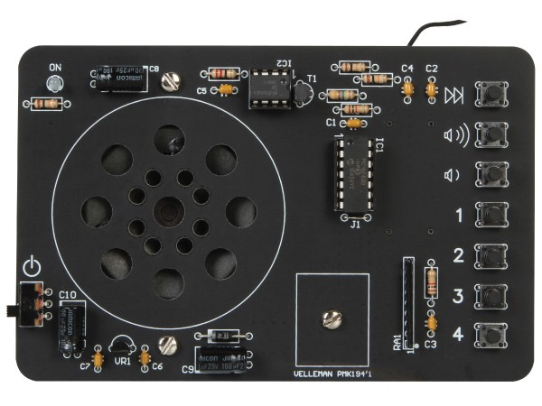

# Elderly-bed-radio
Simple one button radio for elderly peoples.

The original FM radio module is Velleman MK194N: https://www.velleman.eu/products/view/?id=431474

## Changes
Replaced buttons with rotary-encore to control volume and on-off switch. Arduino Pro Mini reads rotary-encoder and send button signal to radio board.