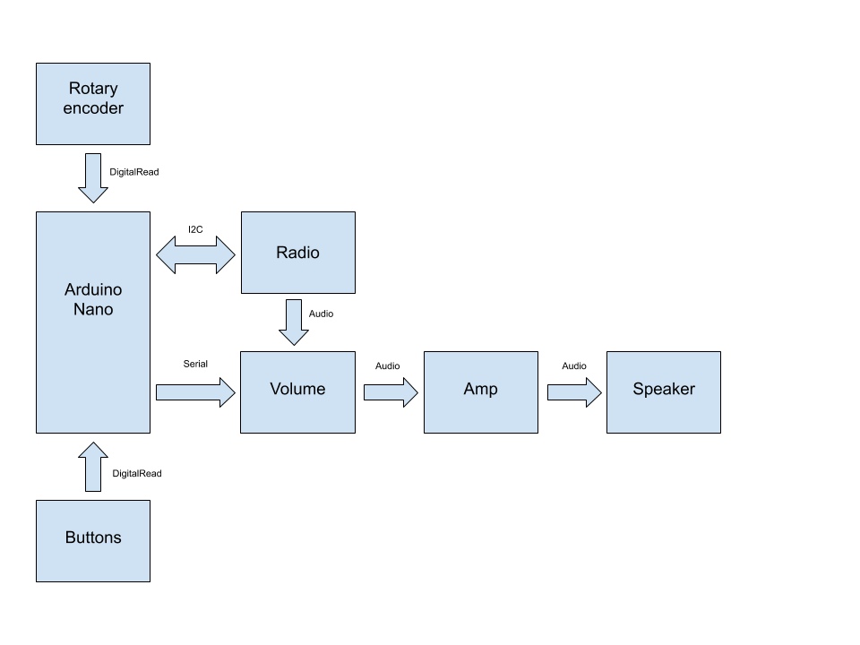
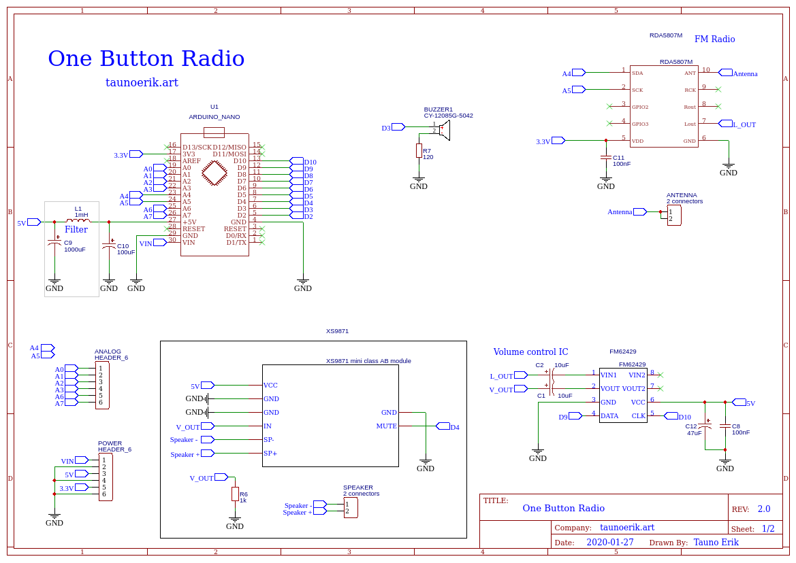
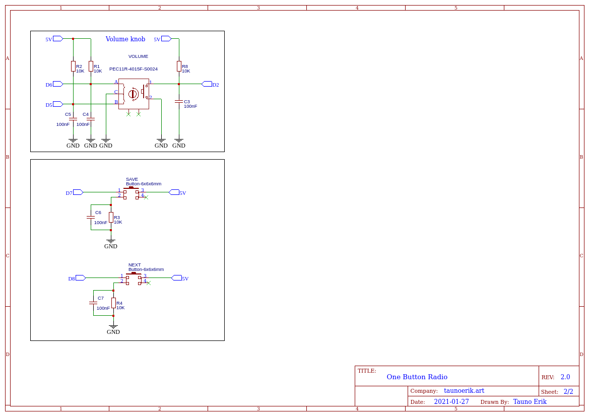

# One Button Radio

Simple one button radio (for elderly peoples?).

## Description

Preset for one channel. The main user can change volume and turn it on/off.

### Front panel

- Speaker
- Rotary Encoder to change volume

## Back panel

- Button to search next channel
- Button to save current channel

### Block diagram

### Schematics

___

Copyright 2021 Tauno Erik https://taunoerik.art
